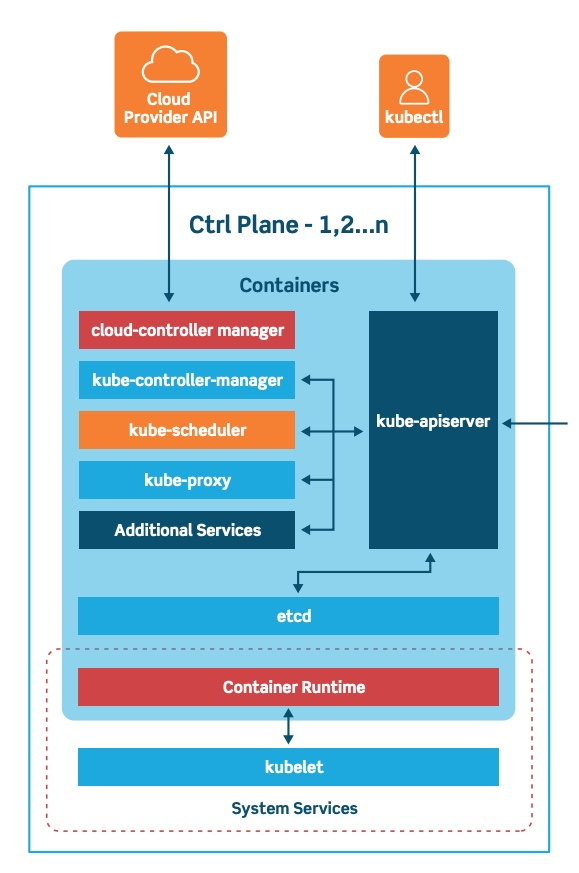
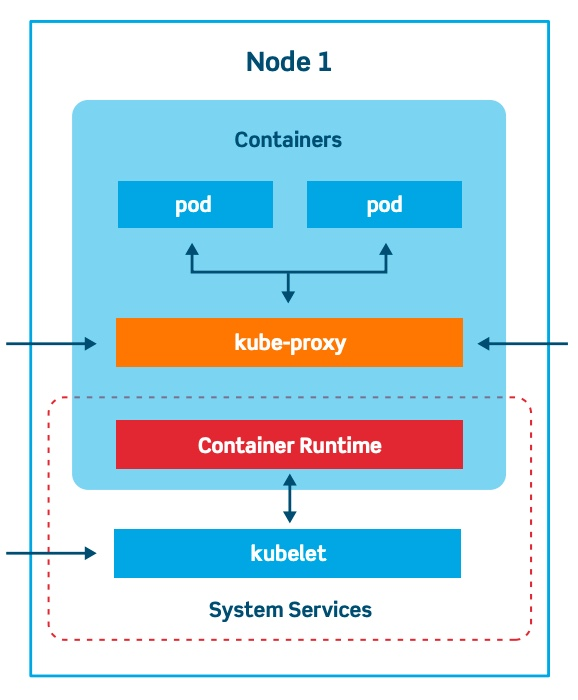

# Kubernetes Architecture
From a high level, a Kubernetes environment/cluster consists of a control plane (master), and a number of worker nodes (slaves)

# Kubernetes Control Plane
The control plane is the system that maintains a record of all Kubernetes objects. It continuously manages object states, responding to changes in the cluster; it also works to make the actual state of system objects match the desired state. As the above illustration shows, the control plane is made up of three major components: kube-apiserver, kube-controller-manager and kube-scheduler. These can all run on a single master node, or can be replicated across multiple master nodes for high availability.

# Worker Nodes
Worker nodes are machines that run containers and are managed by the master nodes. The Kubelet is the primary and most important controller in Kubernetes. It’s responsible for driving the container execution layer.

